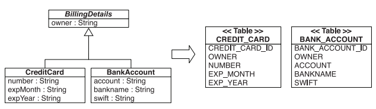
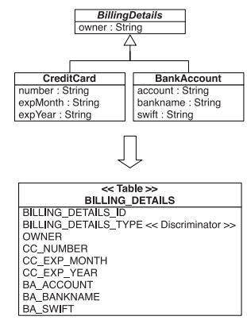
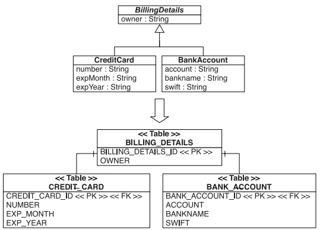
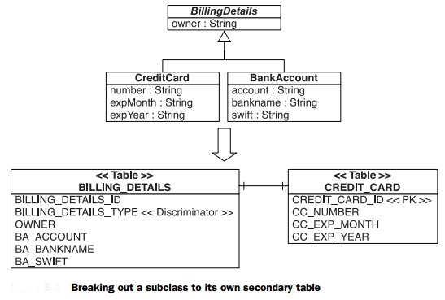
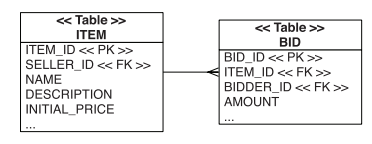
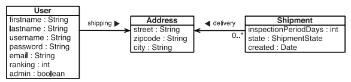
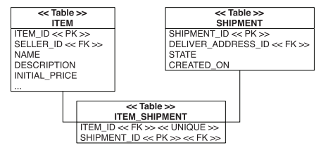

# Hibernate notes

### Table of contents
1. [Mapping persistent classes](#mapping-persistent-classes) 
    * [Entities and value types](#entities-values-types) 
        + [Hibernate types](#hibernate-types) 
    * [Mapping entities with identity](#mapping-entities-identity) 
        + [Id generators](#id-generators) 
    * [Class mapping options](#class-mapping-options) 
        + [Dynamic SQL generation](#dynamic-sql-generation) 
        + [Making an entity immutable](#immutable-entity) 
        + [Customizing property access](#property-access) 
        + [Using derived properties](#derived-properties) 
        + [Generated and default property values](#generated-default-property-values) 
        + [Annotating embedded classes](#annotating-embedded-classes) 
2. [Mapping class inheritance and custom types](#mapping-class-inheritance-and-custom-types) 
    * [Mapping class inheritance](#mapping-class-inheritance) 
        + [Table per class with implicit polymorphism](#table-per-class-with-implicit-polymorphism) 
        + [Table per concrete class with unions](#table-per-concrete-class) 
        + [Table per class hierarchy](#table-per-class-hierarchy) 
        + [Table per subclass](#table-per-subclass) 
        + [Mixing inheritance strategies](#"mixing-inheritance-strategies) 
        + [Choosing a strategy](#choosing-strategy) 
    * [The Hibernate type system](#hibernate-type-system)
        + [Built-in mapping types](#build-in-mapping-types)
        + [Date and time mapping types](#date-time-mapping-types)
        + [Binary and large value mapping types](#binary-large-mapping-types)
        + [JDK mapping types](#jdk-mapping-types)
        + [Using mapping types](#using-mapping-types)
    * [Creating custom mapping types](#custom-mapping-system)
        + [The extension points](#extensions-points)
        + [Creating a UserType](#creating-user-type)
        + [Creating a CompositeUserType](#creating-composite-user-type)
        + [Parameterizing custom types](#parameterizing-custom-type)
        + [Mapping enumerations](#mapping-enums)
3. [Mapping collections and entity associations](#mapping-collections-and-entity-associations)
    * [Sets, bags, lists, and maps of value types](#sets-bags-lists-maps)
        + [Basic collection mapping](#basic-collection-mapping)
        + [Sorted and ordered collections](#sorted-and-ordered-collections)
    * [Mapping a parent-child relationship](#mapping-parent-child-associations)
        + [The simplest possible association](#simplest-association)
        + [Cascading object state](#cascading-object-state)
4. [Advanced entity association mappings](#advanced-entity-association-mappings)
    * [Single-valued entity associations](#single-valued-associations)
        + [One-to-one foreign key associations](#one-to-one-foreign)
        + [One-to-one with join table](#one-to-one-jointable)
    * [Many-valued entity associations](#many-valued-associations)
        + [One-to-many associations](#one-to-many-associations)
        + [Many-to-many associations](#many-to-many-associations)
        + [Mapping maps](#mapping-maps)
        + [Ternary associations](#ternary-associations)
        
<hr>
Hibernate (and JPA) require a constructor with no arguments for every persistent class. Hibernate calls persistent classes using Reflection API to init objects.
Constructor may be non public, but it has to be at least package-visible. Proxy generation also requires that the class isn't declared final
Hibernate requires interfaces for collection-typed attributes

Hibernate automatically detects object state changes in order to synchronize the updated state with the database.
It’s usually safe to return a different object from the getter method than the object passed by Hibernate to the setter. Hibernate compares the objects by value—not by object identity—to determine whether the property’s persistent state needs to be updated. For example, the following getter method doesn’t result in unnecessary SQL UPDATEs:

```
public String getFirstname() {
 return new String(firstname);
}
```
There is one important exception to this: Collections are compared by identity! For a property mapped as a persistent collection, you should return exactly the same collection instance from the getter method that Hibernate passed to the setter method. If you don’t, Hibernate will update the database, even if no update is necessary, every time the state held in memory is synchronized with the database.

If a `RuntimeException` is thrown, the current transaction is rolled back, and the exception is yours to handle.
If a checked application exception is thrown, Hibernate wraps the exception into a `RuntimeException`

It is possible to manipulate metadata in runtime:

```
// Get the existing mapping for User from Configuration
PersistentClass userMapping =
 cfg.getClassMapping(User.class.getName());
 
// Define a new column for the USER table
Column column = new Column();
column.setName("MOTTO");
column.setNullable(false);
column.setUnique(true);
userMapping.getTable().addColumn(column);

// Wrap the column in a Value
SimpleValue value = new SimpleValue();
value.setTable( userMapping.getTable() );
value.setTypeName("string");
value.addColumn(column);

// Define a new property of the User class
Property prop = new Property();
prop.setValue(value);
prop.setName("motto");
prop.setNodeName(prop.getName());
userMapping.addProperty(prop);

// Build a new session factory, using the new mapping
SessionFactory sf = cfg.buildSessionFactory();
```

A `PersistentClass` object represent the metamodel for a single persisten class.
`Column`, 'SimpleValue' nad 'Property' are all classes of Hibernate metamodel
Note that once a `SessionFactory` is created its mapping are immutable. There is no way to make changes in metamodel, however that application can read metamodel by calling `getClassMetadata`:

```
Item item = ...;
ClassMetadata meta = sessionFactory.getClassMetadata(Item.class);
String[] metaPropertyNames =
 meta.getPropertyNames();
Object[] propertyValues =
 meta.getPropertyValues(item, EntityMode.POJO);
 ```

<a name="mapping-persistent-classes"/>

## Mapping persistent classes

<a name="entities-values-types"/>

### Entities and value types

<a name="hibernate-types"/>

#### Hibernate types
Hibernate categorizes types into two groups:
* Value types
* Entity types

**Value types**
A value type is a piece of data that does not define its own lifecycle. It is, in effect, owned by an entity, which defines its lifecycle.
Looked at another way, all the state of an entity is made up entirely of value types. These state fields or JavaBean properties are termed *persistent attributes*. The persistent attributes of the `Contact` class are value types.

**Entity types**
Entities, by nature of their unique identifier, exist independently of other objects whereas values do not. Entities are domain model classes which correlate to rows in a database table, using a unique identifier. Because of the requirement for a unique identifier, entities exist independently and define their own lifecycle. The `Contact` class itself would be an example of an entity.

Hint: First of all try to make everything as value-typed class and promote it to an entity only when absolutely necessary.
As the next step you should care about three things:
* _Shared references_: Write your POJO classes in a way that avoids shared references to value type instances. For example, make sure an `Address` object can be referenced by only one `User`. For example, make it immutable and enforce the relationship with the `Address` constructor
* _Lifecycle dependencies_: As discussed, the lifecycle of a value-type instance is bound to that of its owning entity instance. If a User object is deleted, its `Address` dependent object(s) have to be deleted as well.
* _Identity_: Entity classes need an identifier property in almost all cases. User-defined value-type classes (and JDK classes) don’t have an identifier property, because instances are identified through the owning entity.

<a name="mapping-entities-identity"/>

### Mapping entities with identity

<a name="id-generators"/>

#### Id generators
| Generator name | JPA GenerationType | Description                                                                                                                                                                                                                                                                                                                                                                                                                                                                                                                                                                                                                                                                                                                                                                                                                                                                                                                                                                                                                                               |
|----------------|--------------------|-----------------------------------------------------------------------------------------------------------------------------------------------------------------------------------------------------------------------------------------------------------------------------------------------------------------------------------------------------------------------------------------------------------------------------------------------------------------------------------------------------------------------------------------------------------------------------------------------------------------------------------------------------------------------------------------------------------------------------------------------------------------------------------------------------------------------------------------------------------------------------------------------------------------------------------------------------------------------------------------------------------------------------------------------------------|
| native         | AUTO               | The native identity generator picks other identity generators like identity,sequence, or hilo, depending on the capabilities of the underlying database. Use this generator to keep your mapping metadata portable to different database management systems.                                                                                                                                                                                                                                                                                                                                                                                                                                                                                                                                                                                                                                                                                                                                                                                              |
| identity       | IDENTITY           | This generator supports identity columns in DB2, MySQL, MS SQL Server, Sybase, and HypersonicSQL. The returned identifier is of type long, short, or int.                                                                                                                                                                                                                                                                                                                                                                                                                                                                                                                                                                                                                                                                                                                                                                                                                                                                                                 |
| sequence       | SEQUENCE           | This generator creates a sequence in DB2, PostgreSQL, Oracle, SAP DB, or Mckoi; or a generator in InterBase is used. The returned identifier is of type long, short, or int. Use the sequence option to define a catalog name for the sequence (hibernate_ sequence is the default) and parameters if you need additional settings creating a sequence to be added to the DDL.                                                                                                                                                                                                                                                                                                                                                                                                                                                                                                                                                                                                                                                                            |
| increment      | (Not available)    | At Hibernate startup, this generator reads the maximum (numeric) primary key column value of the table and increments the value by one each time a new row is inserted. The generated identifier is of type long, short, or int. This generator is especially efficient if the single-server Hibernate application has exclusive access to the database but should not be used in any other scenario.                                                                                                                                                                                                                                                                                                                                                                                                                                                                                                                                                                                                                                                     |
| hilo           | (Not available)    | A high/low algorithm is an efficient way to generate identifiers of type long, given a table and column (by default hibernate_unique_key and next, respectively) as a source of high values. The high/low algorithm generates identifiers that are unique only for a particular database. High values are retrieved from a global source and are made unique by adding a local low value. This algorithm avoids congestion when a single source for identifier values has to be accessed for many inserts. See “Data Modeling 101” (Ambler, 2002) for more information about the high/low approach to unique identifiers. This generator needs to use a separate database connection from time to time to retrieve high values, so it isn’t supported with user-supplied database connections. In other words, don’t use it with sessionFactory.openSession(myCo nnection). The max_lo option defines how many low values are added until a new high value is fetched. Only settings greater than 1 are sensible; the default is 32767 (Short.MAX_VALUE). |
| seqhilo        | (Not available)    | This generator works like the regular hilo generator, except it uses a named database sequence to generate high values.                                                                                                                                                                                                                                                                                                                                                                                                                                                                                                                                                                                                                                                                                                                                                                                                                                                                                                                                   |
| (JPA only)     | TABLE              | Much like Hibernate’s hilo strategy, TABLE relies on a database table that holds the lastgenerated integer primary key value, and each generator is mapped to one row in this table. Each row has two columns: pkColumnName and valueColumnName. The pkColumnValue assigns each row to a particular generator, and the value column holds the last retrieved primary key. The persistence provider allocates up to allocationSize integers in each turn.                                                                                                                                                                                                                                                                                                                                                                                                                                                                                                                                                                                                  |
| uuid.hex       | (Not available)    | This generator is a 128-bit UUID (an algorithm that generates identifiers of type string, unique within a network). The IP address is used in combination with a unique timestamp. The UUID is encoded as a string of hexadecimal digits of length 32, with an optional separator string between each component of the UUID representation. Use this generator strategy only if you need globally unique identifiers, such as when you have to merge two databases regularly.                                                                                                                                                                                                                                                                                                                                                                                                                                                                                                                                                                             |
| guid           | (Not available)    | This generator provides a database-generated globally unique identifier string on MySQL and SQL Server.                                                                                                                                                                                                                                                                                                                                                                                                                                                                                                                                                                                                                                                                                                                                                                                                                                                                                                                                                   |
| select         | (Not available)    | This generator retrieves a primary key assigned by a database trigger by selecting the row by some unique key and retrieving the primary key value. An additional unique candidate key column is required for this strategy, and the key option has to be set to the name of the unique key column.                                                                                                                                                                                                                                                                                                                                                                                                                                                                                                                                                                                                                                                                                                                                                       |

If you want to use Hibernate identifier, that is not available in JPA, you can use `org.hibernate.annotations.GenericGenerator` annotation:
```
@Entity
@org.hibernate.annotations.GenericGenerator(
 name = "hibernate-uuid",
 strategy = "uuid"
)
class name MyEntity {
 @Id
 @GeneratedValue(generator = "hibernate-uuid")
 @Column(name = "MY_ID")
 String id;
}
```

If you want to make your custom sequence generator, you should use `SequenceGenerator` annotation:
```
@Entity
@SequenceGenerator(name = "MY_SEQ", initialValue = 123, allocationSize = 20)
class name MyEntity {
    @Id @GeneratedValue(generator = "mySequenceGenerator")
    String id;
}
```

To create own identifier generator `IdentifierGenerator` interface should be implemented
 
<a name="class-mapping-options"/>

### Class mapping options
 
 <a name="dynamic-sql-generation"/>
 
#### Dynamic SQL generation
In some situations, such as a legacy table with hundreds of columns where the SQL statements will be large for even the simplest operations (say, only one column needs updating), you have to turn off this startup SQL generation and switch to dynamic statements generated at runtime.
To disable dynamic insertion/updating you have to use `@DynamicInsert` and `@DynamicUpdate` annotations
It is also useful for immutable classes

<a name="immutable-entity"/>

#### Making an entity immutable
Just put `@Immutable` annotation under the entity. It will entail avoiding dirty checking, for example.

To exclude field from entity you can mark property with the `@Transient` annotation or use `transient` keyword

If a property of persistent class isn't annotated, the following rules apply:
* If the property of a JDK type, it's automatically persistent;
* Otherwise, if the class of the property is annotated as `@Embeddable`, it's mapped as a component of the owning class;
* Otherwise, if the type of the property is `Serializable` its value is stored in its serialized form. It's usually not you want!

To customize this rules apply the `@Basic` annotation

<a name="property-access"/>

#### Customizing property access
* If `AccessType` is set on the class level, all attributes of the class are accessed according to the selected strategy.
* If an entity defaults or is explicitly set for field access, the `AccessType("property")` annotation on a field switches this particular attribute to runtime access through property getter/setter methods. The position of the `AccessType` annotation is still the field.
* If an entity defaults or is explicitly set for property access, the `AccessType("field")` annotation on a getter method switches this particular attribute to runtime access through a field of the same name. The position of the `AccessType` annotation is still the getter method.
* Any `@Embedded` class inherits the default or explicitly declared access strategy of the owning root entity class.
* Any `@MappedSuperclass` properties are accessed with the default or explicitly declared access strategy of the mapped entity class.

<a name="derived-properties"/>

#### Using derived properties
```
@org.hibernate.annotations.Formula("TOTAL + TAX_RATE * TOTAL")
public BigDecimal getTotalIncludingTax() {
    return totalIncludingTax;
}
```

<a name="generated-default-property-values"/>

#### Generated and default property values
```
@Column(updatable = false, insertable = false)
@org.hibernate.annotations.Generated(
 org.hibernate.annotations.GenerationTime.ALWAYS
)
private Date lastModified;
```

```
@Column(name = "INITIAL_PRICE",
 columnDefinition = "number(10,2) default '1'")
@org.hibernate.annotations.Generated(
 org.hibernate.annotations.GenerationTime.INSERT
)
private BigDecimal initalPrice;
```

<a name="annotating-embedded-classes"/>

#### Annotating embedded classes
[Mapping example(Address and User classes)](src/main/java/app/book/entities/)

<a name="mapping-class-inheritance-and-custom-types"/>

## Mapping class inheritance and custom types

<a name="mapping-class-inheritance"/>

### Mapping class inheritance
There are four different approaches to representing an inheritance hierarchy:
* Table per concrete class with implicit polymorphism—Use no explicit inheritance mapping, and default runtime polymorphic behavior.
* Table per concrete class—Discard polymorphism and inheritance relationships completely from the SQL schema
* Table per class hierarchy—Enable polymorphism by denormalizing the SQL schema, and utilize a type discriminator column that holds type information.
* Table per subclass—Represent is a (inheritance) relationships as has a (foreign key) relationships. 

<a name="table-per-class-with-implicit-polymorphism"/>

#### _Table per class with implicit polymorphism_
You can use exactly one table for each (nonabstract) class. All properties of a class, including inherited properties, can be mapped to columns of this table, as shown in figure.


The main problem with this approach is that it doesn’t support polymorphic associations very well. In the database, associations are usually represented as foreign key relationships. In figure 5.1, if the subclasses are all mapped to different tables, a polymorphic association to their superclass (abstract BillingDetails in this example) can’t be represented as a simple foreign key relationship. This would be problematic in our domain model, because BillingDetails is associated with User; both subclass tables would need a foreign key reference to the USERS table. Or, if User had a many-to-one relationship with BillingDetails, the USERS table would need a single foreign key column, which would have to refer both concrete subclass tables. This isn’t possible with regular foreign key constraints. 

[Mapping example(Address and User classes)](src/main/java/app/book/entities/inheritanceexamples/implicitpolymorphism)

<a name="table-per-concrete-class"/>

#### _Table per concrete class with unions_
1. An abstract superclass or an interface has to be declared as abstract="true"; otherwise
a separate table for instances of the superclass is needed.
2. The database identifier mapping is shared for all concrete classes in the hierarchy.
The CREDIT_CARD and the BANK_ACCOUNT tables both have a BILLING_DETAILS_ID
primary key column. The database identifier property now has to be shared for all
subclasses; hence you have to move it into BillingDetails and remove it from
CreditCard and BankAccount.
3. Properties of the superclass (or interface) are declared here and inherited by all
concrete class mappings. This avoids duplication of the same mapping.
4. A concrete subclass is mapped to a table; the table inherits the superclass (or
interface) identifier and other property mappings. 

[Mapping example(Address and User classes)](src/main/java/app/book/entities/inheritanceexamples/tableperclass)

<a name="table-per-class-hierarchy"/>

#### _Table per class hierarchy_


There is one major problem: Columns for properties declared by subclasses must be declared to be nullable.
[Mapping example(Address and User classes)](src/main/java/app/book/entities/inheritanceexamples/tableperclasshierarchy)

Also you can write `@DiscriminatorFormula` instead of `@DiscriminatorValue` in subclasses:
```
@org.hibernate.annotations.DiscriminatorFormula(
 "case when CC_NUMBER is not null then 'CC' else 'BA' end"
)
```

<a name="table-per-subclass"/>

#### _Table per subclass_
The fourth option is to represent inheritance relationships as relational foreign key associations. Every class/subclass that declares persistent properties—including abstract classes and even interfaces—has its own table.


<a name="mixing-inheritance-strategies"/>
#### _Mixing inheritance strategies_

```
@Entity
@DiscriminatorValue("CC")
@SecondaryTable(
 name = "CREDIT_CARD",
 pkJoinColumns = @PrimaryKeyJoinColumn(name = "CREDIT_CARD_ID")
)
public class CreditCard extends BillingDetails {
 @Column(table = "CREDIT_CARD",
 name = "CC_NUMBER",
 nullable = false)
 private String number;
 ...
}
```

<a name="choosing-strategy"/>

#### Choosing a strategy
* If you don’t require polymorphic associations or queries, lean toward tableper-concrete-class—in other words, if you never or rarely query for BillingDetails and you have no class that has an association to BillingDetails (our model has). An explicit UNION-based mapping should be preferred, because (optimized) polymorphic queries and associations will then be possible later. Implicit polymorphism is mostly useful for queries utilizing non-persistence-related interfaces.
* If you do require polymorphic associations (an association to a superclass, hence to all classes in the hierarchy with dynamic resolution of the concrete class at runtime) or queries, and subclasses declare relatively few properties (particularly if the main difference between subclasses is in their behavior), lean toward table-per-class-hierarchy. Your goal is to minimize the number of nullable columns and to convince yourself (and your DBA) that a denormalized schema won’t create problems in the long run.
* If you do require polymorphic associations or queries, and subclasses declare many properties (subclasses differ mainly by the data they hold), lean toward table-per-subclass. Or, depending on the width and depth of your inheritance hierarchy and the possible cost of joins versus unions, use table-per-concrete-class.
By default, choose table-per-class-hierarchy only for simple problems. For more complex cases (or when you’re overruled by a data modeler insisting on the importance of nullability constraints and normalization), you should consider the table-per-subclass strategy.

<a name="hibernate-type-system"/>

### The Hibernate type system

<a name="build-in-mapping-types"/>

#### Built-in mapping types

| **Mapping type** | **Java type**      | **SQL built-in type** |
|------------------|--------------------|-----------------------|
| integer          | int or Integer     | INTEGER               |
| long             | long or Long       | BIGINT                |
| short            | short or Short     | SMALLINT              |
| float            | float or Float     | FLOAT                 |
| double           | double or Double   | DOUBLE                |
| big_decimal      | BigDecimal         | NUMERIC               |
| character        | String             | CHAR(1)               |
| string           | String             | VARCHAR               |
| byte             | byte or Byte       | TINYINT               |
| boolean          | boolean or Boolean | BIT                   |
| yes_no           | boolean or Boolean | CHAR(1) ('Y' or 'N' ) |
| true_false       | boolean or Boolean | CHAR(1) ('T' or 'F')  |

<a name="date-time-mapping-types"/>

#### Date and time mapping types

| **Mapping type** | **Java type**                        | **SQL built-in type** |
|------------------|--------------------------------------|-----------------------|
| date             | java.util.Date or java.sql.Date      | DATE                  |
| time             | java.util.Date or java.sql.Time      | TIME                  |
| timestamp        | java.util.Date or java.sql.Timestamp | TIMESTAMP             |
| calendar         | java.util.Calendar                   | TIMESTAMP             |
| calendar_date    | java.util.Calendar                   | DATE                  |

<a name="binary-large-mapping-types"/>

#### Binary and large value mapping types

| **Mapping type** | **Java type**           | **SQL built-in type** |
|------------------|-------------------------|-----------------------|
| binary           | byte[]                  | VARBINARY             |
| text             | java.lang.String        | CLOB                  |
| clob             | java.sql.Clob           | CLOB                  |
| blob             | java.sql.Blob           | BLOB                  |
| serializable     | implements Serializable | VARBINARY             |

If you want to map some `String` or `char[]` as `Lob` you have to put `@Lob` annotation under the field.
Also it can be applied to `byte[]` or `Byte[]`

<a name="jdk-mapping-types"/>

#### JDK mapping types

| **Mapping type** | **Java type**           | **SQL built-in type** |
|------------------|-------------------------|-----------------------|
| class            | Class                   | VARCHAR               |
| locale           | java.util.Locale        | VARCHAR               |
| timezone         | java.util.TimeZone      | VARCHAR               |
| currency         | java.util.Currency      | VARCHAR               |

<a name="using-mapping-types"/>

####  Using mapping types

The mapping type of a property is automatically detected, just like in Hibernate. For a java.util.Date or java.util.Calendar property, the Java Persistence standard requires that you select the precision with a @Temporal annotation:
```
@Temporal(TemporalType.TIMESTAMP)
@Column(nullable = false, updatable = false)
private Date startDate;
```

In other rare cases, you may want to add the `@org.hibernate.annotations.Type` annotation to a property and declare the name of a built-in or custom Hibernate mapping type explicitly

<a name="custom-mapping-system"/>

### Creating custom mapping types

<a name="extensions-points"/>

#### The extension points

Hibernate provides several interfaces that applications may use to define custom mapping types:
* `org.hibernate.usertype.UserType` provides the basic methods for custom loading and storing of value type instances.
* `org.hibernate.usertype.CompositeUserType` - an interface with more methods than the basic UserType, used to expose internals about your value type class to Hibernate, such as the individual properties.
* `org.hibernate.usertype.UserCollectionType` - a rarely needed interface that’s used to implement custom collections.
* `org.hibernate.usertype.EnhancedUserType` - an interface that extends UserType and provides additional methods for marshalling value types toand from XML representations, or enables a custom mapping type for use in identifier and discriminator mappings.
* `org.hibernate.usertype.UserVersionType` - an interface that extends UserType and provides additional methods enabling the custom mapping type for usage in entity version mappings.
* `org.hibernate.usertype.ParameterizedType` - a useful interface that can be combined with all others to provide configuration settings—that is, parameters defined in metadata. For example, you can write a single MoneyConverter that knows how to translate values into Euro or US dollars, depending on a parameter in the mapping.

<a name="creating-user-type"/>

#### Creating a UserType

In order to create custom UserType you should implement `UserType` interface
[MonetaryAmountUserType example](src/main/java/app/book/entities/custommappingtypes/usertypes/)

1. The `sqlTypes()` method tells Hibernate what SQL column types to use for DDL schema generation. Notice that this method returns an array of type codes.
2. The `returnedClass()` method tells Hibernate what Java value type class is mapped by this `UserType`.
3. The `UserType` is also partially responsible for creating a snapshot of a value in the first place. Because `MonetaryAmount` is an immutable class, the `deepCopy()` method returns its argument. In the case of a mutable type, it would need to return a copy of the argument to be used as the snapshot value.
4. The `disassemble()` method is called when Hibernate puts a `MonetaryAmount` into the second-level cache. As you’ll learn later, this is a cache of data that stores information in a serialized form.
5. The `assemble()` method does the opposite of disassembly: It can transform cached data into an instance of MonetaryAmount. As you can see, implementation of both routines is easy for immutable types.
6. Implement `replace()` to handle merging of detached object state.
7. The `nullSafeGet()` method retrieves the property value from the JDBC `ResultSet`.
8. The `nullSafeSet()` method writes the property value to the JDBC `PreparedStatement`.

<a name="creating-composite-user-type"/>

#### Creating a CompositeUserType

In order to create custom CompositeUserType you should implement `CompositeUserType` interface
[MonetaryAmountCompositeUserType example](src/main/java/app/book/entities/custommappingtypes/usertypes/)

1. The `CompositeUserType` interface requires the same housekeeping methods as the `UserType`. However, the `sqlTypes()` method is no longer needed.
2. Loading a value now is straightforward: You transform two column values in the result set to two property values in a new `MonetaryAmount` instance.
3. Saving a value involves setting two parameters on the prepared statement.
4. A `CompositeUserType` exposes the properties of the value type through `getPropertyNames()`.
5. The properties each have their own type, as defined by `getPropertyTypes()`. The types of the SQL columns are now implicit from this method.
6. The `getPropertyValue()` method returns the value of an individual property of the `MonetaryAmount`.
7. The `setPropertyValue()` method sets the value of an individual property of the `MonetaryAmount`. 

<a name="parameterizing-custom-type"/>

#### Parameterizing custom types

[MonetaryAmountConversionType example](src/main/java/app/book/entities/custommappingtypes/usertypes/)

```
@org.hibernate.annotations.TypeDefs({
 @org.hibernate.annotations.TypeDef(
 name="monetary_amount_usd",
 typeClass = persistence.MonetaryAmountConversionType.class,
 parameters = { @Parameter(name="convertTo", value="USD") }
 ),
 @org.hibernate.annotations.TypeDef(
 name="monetary_amount_eur",
 typeClass = persistence.MonetaryAmountConversionType.class,
 parameters = { @Parameter(name="convertTo", value="EUR") }
 )
})
```
This annotation metadata is global, so it can be placed outside any Java class declaration (right after the import statements) or in a separate file, package-info.java. A good location in this system is in a package-info.java file in the persistence package.

```
@org.hibernate.annotations.Type(type = "monetary_amount_eur")
@org.hibernate.annotations.Columns({
 @Column(name = "BID_AMOUNT"),
 @Column(name = "BID_AMOUNT_CUR")
})
private MonetaryAmount bidAmount;
```

<a name="mapping-enums"/>

#### Mapping enumerations

Instead of the most basic `UserType` interface, we now we will use the `EnhancedUserType` interface.
First of all you have to write your custom enumeration handler that should implement `EnhancedUserType` and `ParameterizedType` interfaces
And that map in the entity class:

```
@Enumerated(EnumType.STRING)
 @Column(name = "RATING", nullable = false, updatable = false)
 private Rating rating;
```

<a name="mapping-collections-and-entity-associations"/>

## Mapping collections and entity associations

<a name="sets-bags-lists-maps"/>

### Sets, bags, lists, and maps of value types

Without extending Hibernate you can choose from the following collections:
* `java.util.Set` is mapped with a `<set>` and initialized with a `HashSet`
* `java.util.SortedSet` is mapped with a `<set>` and initialized with a `TreeSet`
* `java.util.List` is mapped with a `<list>` and initialized with a `ArrayList`
* `java.util.Collection` can be mapped with a `<bag>` or `<idbag>` and initialized with a `ArrayList`
* `java.util.Map` is mapped with a `<map>` and initialized with a `HashMap`
* `java.util.SortedMap` is mapped with a `<map>` and initialized with a `TreeMap`

<a name="basic-collection-mapping"/>

#### Basic collection mapping

The following maps a simple collection of `String` elements:
```
@org.hibernate.annotations.CollectionOfElements(
 targetElement = java.lang.String.class
)
@JoinTable(
 name = "ITEM_IMAGE",
 joinColumns = @JoinColumn(name = "ITEM_ID")
)
@Column(name = "FILENAME", nullable = false)
private Set<String> images = new HashSet<String>();
```

To map a persistent `List`, add `@org.hibernate.annotations.IndexColumn` with an optional base for the index (default is zero):
```
@org.hibernate.annotations.CollectionOfElements
@JoinTable(
 name = "ITEM_IMAGE",
 joinColumns = @JoinColumn(name = "ITEM_ID")
)
@org.hibernate.annotations.IndexColumn(
 name="POSITION", base = 1
)
@Column(name = "FILENAME")
private List<String> images = new ArrayList<String>();
```
If you forget the index column, this list would be treated as a bag collection.

To map a persistent map, use `@org.hibernate.annotations.MapKey`:
```
@org.hibernate.annotations.CollectionOfElements
@JoinTable(
 name = "ITEM_IMAGE",
 joinColumns = @JoinColumn(name = "ITEM_ID")
)
@org.hibernate.annotations.MapKey(
 columns = @Column(name="IMAGENAME")
)
@Column(name = "FILENAME")
private Map<String, String> images = new HashMap<String, String>();
```

<a name="sorted-and-ordered-collections"/>

#### Sorted and ordered collections

A collection can also be sorted or ordered with Hibernate annotations:

```
@org.hibernate.annotations.CollectionOfElements
@JoinTable(
 name = "ITEM_IMAGE",
 joinColumns = @JoinColumn(name = "ITEM_ID")
)
@Column(name = "FILENAME", nullable = false)
@org.hibernate.annotations.Sort(
 type = org.hibernate.annotations.SortType.NATURAL
)
private SortedSet<String> images = new TreeSet<String>();
```
The @Sort annotation supports various SortType attributes, with the same semantics as the XML mapping options. The shown mapping uses a java.util.SortedSet (with a java.util.TreeSet implementation) and natural sort order. If you enable SortType. COMPARATOR, you also need to set the comparator attribute to a class that implements your comparison routine.

Maps, sets, and even bags, can be ordered on load, by the database, through an SQL fragment in the ORDER BY clause:
```
@org.hibernate.annotations.OrderBy(
 clause = "FILENAME asc"
)
```

Finally, you can map a collection of components, of user-defined value-typed elements. You need to add the `@Embeddable` component annotation on that class to enable embedding:
```
@Embeddable
public class Image {
 @org.hibernate.annotations.Parent
 Item item;
 @Column(length = 255, nullable = false)
 private String name;
 @Column(length = 255, nullable = false)
 private String filename;
 @Column(nullable = false)
 private int sizeX;
 @Column(nullable = false)
 private int sizeY;
 @org.hibernate.annotations.CollectionOfElements
 @JoinTable(
  name = "ITEM_IMAGE",
  joinColumns = @JoinColumn(name = "ITEM_ID")
 )
 @AttributeOverride(
  name = "element.name",
  column = @Column(name = "IMAGENAME",
  length = 255,
  nullable = false)
 )
 private Set<Image> images = new HashSet<Image>();
```

<a name="mapping-parent-child-associations"/>

### Mapping a parent-child relationship

<a name="simplest-association"/>

#### The simplest possible association



[BidItem example](src/main/java/app/book/entities/associationsexamples/entities)

`targetEntity` annotation parameter is used to set type explicitly. An explicit `targetEntity` attribute is useful in more complex domain models - for example, when you map a `@ManyToOne` on a getter method that returns a delegate class, which mimics a particular target entity interface.
`@JoinColumn` is also os optional. If it isn't defined, column name will be `<type>_id`

<a name="cascading-object-state"/>

#### Cascading object state

**Transitive persistence**
To implement transitive persistence you have to put `cascade` parameter into `@OneToMany` annotation

[BidItem example](src/main/java/app/book/entities)

Same can be applied for deletion

<a name="advanced-entity-association-mappings"/>

## Advanced entity association mappings

<a name="single-valued-associations"/>

### Single-valued entity associations



<a name="one-to-one-foreign"/>

#### One-to-one foreign key associations

```
@Entity
@Table(name = "addresses")
public class Address {
    @Id @GeneratedValue(strategy = GenerationType.SEQUENCE)
    private Long id;
    @OneToOne(mappedBy = "shippingAddress")
    private User user;
    @Column(name = "address")
    private String address;
}
```

```
@Entity
@Table(name = "users")
public class User {
    @Id @GeneratedValue(strategy = GenerationType.SEQUENCE)
    private Long id;
    @OneToOne(cascade = CascadeType.ALL)
    @JoinColumn(name = "address_id")
    private Address shippingAddress;
    @Column(name = "user_name")
    private String name;
}
```

<a name="one-to-one-jointable"/>

#### One-to-one with join table



```
public class Shipment {
 @OneToOne
 @JoinTable(
 name="ITEM_SHIPMENT",
 joinColumns = @JoinColumn(name = "SHIPMENT_ID"),
 inverseJoinColumns = @JoinColumn(name = "ITEM_ID")
 )
 private Item auction;
}
```

<a name="many-valued-associations"/>

### Many-valued entity associations

<a name="one-to-many-associations"/>

#### One-to-many associations

One-to-many relation is mapped by `@OneToMany` and `@ManyToOne` annotations. In order to specify join column use `@JoinColumn` annotation
[Mapping example](src/main/java/app/book/entities/manyvaluedexamples)

It is also possible to map one-to-many relationship via additional table:

```
@Entity
public class Item {
 @ManyToOne
 @JoinTable(
 name = "ITEM_BUYER",
 joinColumns = {@JoinColumn(name = "ITEM_ID")},
 inverseJoinColumns = {@JoinColumn(name = "USER_ID")}
 )
 private User buyer;
 ...
}
```

<a name="many-to-many-associations"/>

#### Many-to-many associations

[Mapping example](src/main/java/app/book/entities/manyvaluedexamples)

<a name="mapping-maps"/>

#### Mapping maps

```
@MapKey(name="id")
@OneToMany
private Map<Long,Bid> bidsByIdentifier = new HashMap<Long,Bid>();
```

<a name="ternary-associations"/>

#### Ternary associations


```
@ManyToMany
@org.hibernate.annotations.MapKeyManyToMany(
 joinColumns = @JoinColumn(name = "ITEM_ID")
)
@JoinTable(
 name = "CATEGORY_ITEM",
 joinColumns = @JoinColumn(name = "CATEGORY_ID"),
 inverseJoinColumns = @JoinColumn(name = "USER_ID")
)
private Map<Item,User> itemsAndUser = new HashMap<Item,User>();
```

To create a link between all three entities, if all your instances are already in persistent
state, add a new entry to the map:

```
aCategory.getItemsAndUser().add( anItem, aUser );
```

To remove the link, remove the entry from the map. 